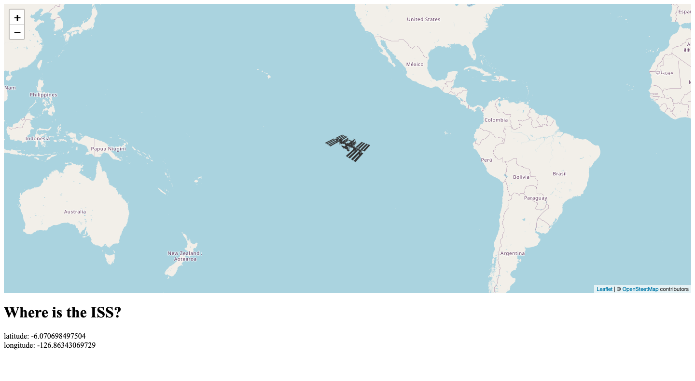

# The Coding Train Project: International Space Station

## Table of contents

- [Overview](#overview)
  - [The challenge](#the-challenge)
  - [Screenshot](#screenshot)
  - [Links](#links)
- [My process](#my-process)
  - [What I learned](#what-i-learned)
  - [Continued development](#continued-development)
  - [Useful resources](#useful-resources)
- [Acknowledgments](#acknowledgments)

## Overview

### The challenge

This is a tutorial project from The Coding Train focused on working with data and APIs in JavaScript. It fetches JSON data from the 'Where the ISS at?' website and uses the realtime Longitude and Latitude coordinates to plot the Space Station's location on a map. The map is displayed via the Leaflet JavaScript library and uses tiles from the OpenStreetMap project. The data is refreshed once a second using setInterval().

### Screenshot

### Links

- Live Site URL: [International Space Station](https://andyferrie.github.io/International-Space-Station/)

## My process

### What I learned

I'm just getting to grips with the basics of working with APIs so I learned about fetch() and how I can work with data within JavaScript. This is also my first experience with Leaflet and OpenStreetMap and I hope to use them both on a future project. 

### Continued development

I intend to complete the rest of The Coding Train content in this series as I have found it super informative. I will try and incorporate what I have learned into my own project. 

### Useful resources

- [The Coding Train YouTube Channel](https://www.youtube.com/channel/UCvjgXvBlbQiydffZU7m1_aw) - I discovered Daniel Shiffman very early on in my learning journey as I first started learning about JavaScript through creative coding and p5.js, I love his enthusiasm and very fast pace.  
- [Where The ISS at?](https://wheretheiss.at/) - Here you can find the ISS data.
- [Leaflet](https://leafletjs.com/) - An open-source JavaScript library for interactive street maps. 
- [OpenSteetMap](https://www.openstreetmap.org) - An open-source map of the world.

## Acknowledgments

Many thanks to all involved in the above projects for providing free content which really helps budding developers like myself. 